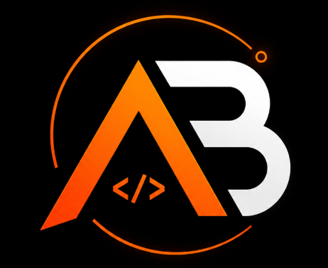

# AgentBench

<div align="center">
  
  <h3>Evaluate. Compare. Improve.</h3>
  <p><strong>A provider-agnostic evaluation and benchmarking platform for AI coding agents.</strong></p>
</div>

---

> **AgentBench** is a provider-agnostic evaluation and benchmarking platform for AI coding agents. Run agents against real software-engineering tasks in isolated environments, execute real test suites, collect execution telemetry and metrics, perform objective scoring & failure analysis, and compare performance across models and agents.

---

## Highlights

* **Free & Local-First by Default**: Works out-of-the-box with **Ollama** and local models (`qwen2.5-coder`, `deepseek-coder-v2`, `llama3.1`). **₹0 / $0 API cost**.
* **Provider-Agnostic**: Pluggable architecture supporting local Ollama, OpenAI (`gpt-4o`, `gpt-4o-mini`), Anthropic (`claude-3-5-sonnet`), Google Gemini (`gemini-1.5-pro`), and custom OpenAI-compatible endpoints.
* **Dual Sandboxing Layer**: Isolated Docker containers or local process sandboxing with strict path traversal prevention, process tree timeouts, and host secret isolation.
* **10 Original Benchmark Tasks**: Real software-engineering repositories covering Bug Fixing, Feature Implementation, Refactoring, Debugging, and Security Patches with real `pytest` suites.
* **Objective Scoring Engine**: Multi-dimensional weighted scoring (Correctness 50%, Test Pass Rate 25%, Code Quality 10%, Efficiency 10%, Reliability 5% -> 0–100 score).
* **Automated Failure Taxonomy**: Automatic classification of failure modes (`wrong_solution`, `test_failure`, `syntax_error`, `timeout`, `tool_misuse`, `incomplete_solution`, `dependency_issue`) with root-cause extraction.
* **Developer-Grade Dashboard & CLI**: High-contrast dark React/Tailwind dashboard with live terminal telemetry streaming + full-featured Typer/Rich CLI.

---

## Architecture

```
┌─────────────────────────────────────────────────────────────┐
│                       AGENTBENCH                            │
│           Evaluate. Compare. Improve.                       │
└─────────────────────────────────────────────────────────────┘
                               │
               ┌───────────────┴───────────────┐
               │                               │
        FREE LOCAL MODE                 API CLOUD MODE
        (Ollama / Local)              (OpenAI/Anthropic/Gemini)
               │                               │
               └───────────────┬───────────────┘
                               │
                       [ Benchmark Task ]
                               │
                      [ Agent Runtime ]
                               │
                    [ Sandboxed Workspace ]
                   (Docker / Safe Process)
                               │
                     [ Surgical Code Edits ]
                               │
                   [ Objective Test Runner ]
                          (Pytest)
                               │
              ┌────────────────┴────────────────┐
              │                                 │
     [ Scoring Engine ]               [ Failure Taxonomy ]
   (Correctness, Pass Rate,          (Root Cause, Misuse,
    Quality, Efficiency, Rel)         Timeouts, Syntactic)
              │                                 │
              └────────────────┬────────────────┘
                               │
                       [ SQLite Storage ]
                               │
              ┌────────────────┴────────────────┐
              │                                 │
        [ Typer CLI ]                 [ React Dashboard ]
```

---

## Quickstart

### 1. Clone & Install Dependencies

```bash
git clone https://github.com/Kaap10/Agent-Bench.git
cd Agent-Bench
pip install -r requirements.txt
```

### 2. (Optional) Run Free Local Model via Ollama

```bash
ollama serve
ollama pull qwen2.5-coder:1.5b
```

### 3. Check System Health

```bash
python agentbench.py doctor
```

Output:
```text
┌───────────────────────────────┐
│ AGENTBENCH ENVIRONMENT DOCTOR │
└───────────────────────────────┘
[OK] Python 3.12.x
[OK] Docker Daemon active (or Local Process Fallback)
[OK] Ollama service connected (qwen2.5-coder:1.5b)
[OK] SQLite persistence ready (sqlite:///./agentbench.db)
```

### 4. Execute a Benchmark

```bash
# Run with local Ollama
python agentbench.py run --benchmark fix-rate-limiter --provider ollama --model qwen2.5-coder:1.5b

# Or run with fast mock provider for testing
python agentbench.py run --benchmark fix-sql-builder --provider mock --model mock-coder
```

### 5. Launch the Web Dashboard

```bash
python agentbench.py serve --port 8000
```
Open **[http://localhost:8000](http://localhost:8000)** in your browser.

---

## CLI Reference

| Command | Description |
|---|---|
| `python agentbench.py doctor` | Diagnose environment, Docker daemon, Ollama status, and API keys. |
| `python agentbench.py init` | Initialize database, workspaces, and seed benchmarks. |
| `python agentbench.py list` | List all available benchmark tasks and test commands. |
| `python agentbench.py run -b <id>` | Launch benchmark execution run. |
| `python agentbench.py results` | List recent run outcomes, scores, and durations. |
| `python agentbench.py inspect <run_id>` | Deep-dive into a run's timeline, git diff, and failure analysis. |
| `python agentbench.py leaderboard` | Display aggregated rankings and model comparisons. |
| `python agentbench.py compare <r1> <r2>` | Compare runs side-by-side. |
| `python agentbench.py serve` | Start FastAPI backend and unified React UI. |

---

## 10 Included Benchmark Tasks

1. **`fix-auth-jwt`** (Bug Fixing — Medium): Fix JWT signature verification, algorithm confusion (`alg: none`), and expiration validation.
2. **`feat-fastapi-pagination`** (Feature — Easy): Implement in-memory API paginator with bounds validation and page slicing.
3. **`fix-rate-limiter`** (Bug Fixing — Easy): Fix sliding-window rate limiter timestamp filtering and limit enforcement.
4. **`fix-sql-builder`** (Bug Fixing — Easy): Implement parameterized SQL queries with `?` placeholders to prevent SQL injection.
5. **`fix-lru-ttl-cache`** (Bug Fixing — Medium): Fix TTL expiration logic, MRU update ordering, and LRU eviction order.
6. **`fix-csv-pipeline`** (Bug Fixing — Medium): Fix date parsing filters, negative amount validation, and zero division errors.
7. **`refactor-tree-serializer`** (Refactoring — Medium): Refactor recursive tree traversal to detect cycles and eliminate infinite loop hazards.
8. **`feat-config-loader`** (Feature — Easy): Implement environment variable overriding with typed integer/boolean parsing.
9. **`debug-async-queue`** (Debugging — Medium): Debug worker heartbeat timeout detection and task requeueing.
10. **`debug-markdown-parser`** (Debugging — Easy): Extract markdown links and images into typed AST token objects.

---

## Real Benchmark Results

AgentBench was evaluated against the 10 software-engineering benchmarks with real local LLMs and agent architectures:

* **Local Model Provider**: Ollama
* **Evaluated Models**: `qwen2.5-coder:1.5b`, `deepseek-r1:1.5b`, `mock-coder`
* **Agent Architectures**: `IterativeCodingAgent` (ReAct multi-step), `FastPatchAgent` (rapid patch), `BaselineAgent` (single-turn)
* **Execution Environment**: Windows 11, Python 3.12.7, Isolated LocalProcessSandbox

| Benchmark Task | Category | Difficulty | IterativeCodingAgent | FastPatchAgent | BaselineAgent |
|---|---|---|---|---|---|
| `fix-auth-jwt` | Bug Fixing | Medium | 37.0 / 100 | - | - |
| `feat-fastapi-pagination` | Feature | Easy | 27.0 / 100 | 27.0 / 100 | - |
| `fix-rate-limiter` | Bug Fixing | Easy | 13.0 / 100 | 13.0 / 100 | 13.0 / 100 |
| `fix-sql-builder` | Bug Fixing | Easy | 32.0 / 100 | 32.0 / 100 | 32.0 / 100 |
| `fix-lru-ttl-cache` | Bug Fixing | Medium | 13.0 / 100 | - | - |
| `fix-csv-pipeline` | Bug Fixing | Medium | 32.0 / 100 | - | - |
| `refactor-tree-serializer` | Refactoring | Medium | 57.0 / 100 | - | - |
| `feat-config-loader` | Feature | Easy | 47.0 / 100 | - | 47.0 / 100 |
| `debug-async-queue` | Debugging | Medium | 37.0 / 100 | - | - |
| `debug-markdown-parser` | Debugging | Easy | 95.0 / 100 | - | - |

---

## Reproducible Demo Flow

```bash
# 1. Start Ollama local service
ollama serve

# 2. Check local models
ollama list

# 3. Environment diagnostic check
python agentbench.py doctor

# 4. Run benchmark with real local Ollama model
python agentbench.py run --benchmark fix-rate-limiter --provider ollama --model qwen2.5-coder:1.5b

# 5. Inspect execution run and git diff
python agentbench.py inspect RUN-0003

# 6. View aggregated leaderboard
python agentbench.py leaderboard

# 7. Start web dashboard
python agentbench.py serve --port 8000
```

---

## Configuration (`.env`)

```env
# Free Local Default (Ollama)
MODEL_PROVIDER=ollama
MODEL_NAME=qwen2.5-coder:1.5b
OLLAMA_BASE_URL=http://localhost:11434

# Optional Cloud API Providers
OPENAI_API_KEY=
ANTHROPIC_API_KEY=
GEMINI_API_KEY=
CUSTOM_API_BASE=
CUSTOM_API_KEY=

# Persistence
DATABASE_URL=sqlite:///./agentbench.db

# Sandboxing Runtime: 'docker' or 'local'
SANDBOX_RUNTIME=local
DOCKER_IMAGE=python:3.11-slim
```

---

## Running Automated Tests

```bash
python -m pytest -v
```

---

## License

MIT License. Free for commercial and personal use.
